<h1 align="center">👋 Hello 👋</h1>

#### Je suis Orion, étudiant à un lycée aux alentours de Strasbourg. Actuellement en seconde, je compte prendre NSI et Maths l'année prochaine, la dernière spé, je ne sais pas.
##### Je touche à l'informatique depuis tout petit et je bricole souvent des projets. La plupart de mes projets ne sont pas trop fini et ne sont pas sur GitHub mais je mets quand même quelques projets sur GitHub.
##### Je suis touche à tout, nous pouvons le voir avec mon projet [scolengo-token-tauri](https://github.com/oriionn/scolengo-token-tauri) qui a été fait sans trop de compétence en [Rust](https://www.rust-lang.org/fr).

## 🌐 Socials:

## 💻 Programming Language & Stack:

## 📌 Pinned Projects

## 📊 GitHub Stats:

